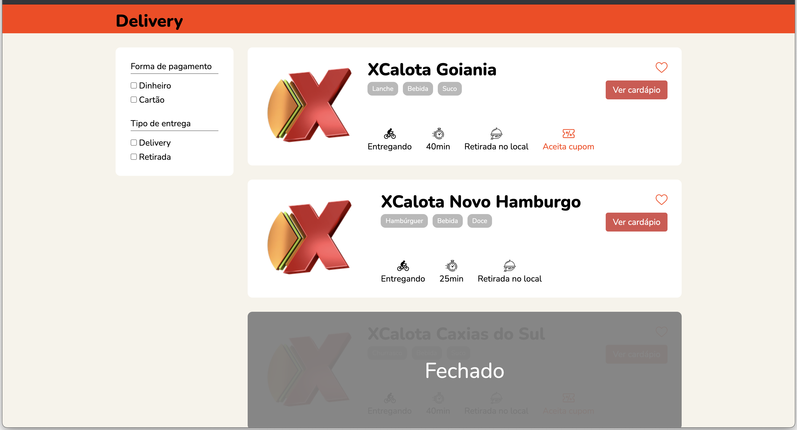

# Restaurant Delivery

## Comandos

| Comando         | O que faz?                  | Observação                     |
| --------------- | --------------------------- | ------------------------------ |
| `npm install`   | Instala pacotes necessários | **Execute isso primeiro!**     |
| `npm start`     | Inicia o desenvolvimento    | Acesse `http://localhost:1234` |
| `npm run build` | Faz build do site           | Resultado na pasta `dist`      |

## Licença
